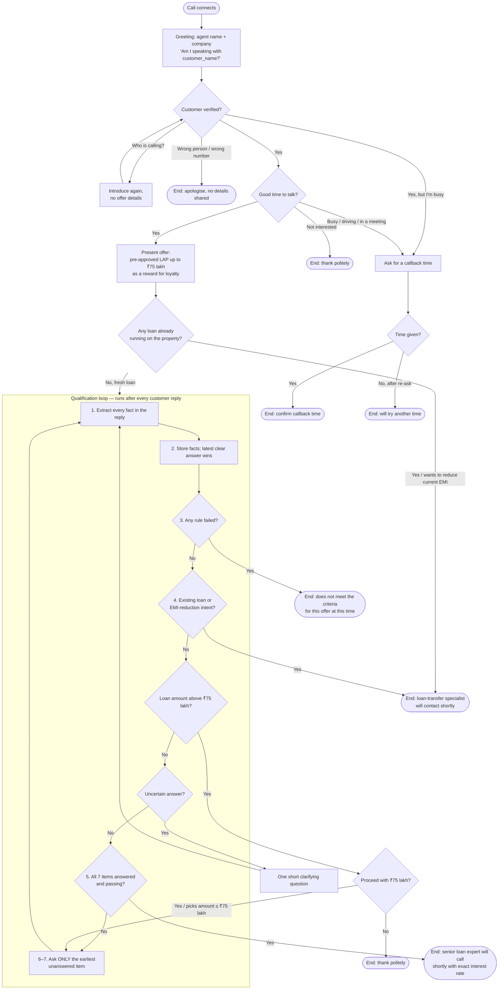

# Conversation Flow

The call is a small state machine. Every customer turn is processed by the same pipeline, and several branches can end the call early. The reference implementation is in [`src/engine/conversation.js`](../src/engine/conversation.js); the system prompt describes the same flow in natural language.

## State machine

## Stages

| Stage | What the agent does | Ways out |
|---|---|---|
| Greeting and verification | Greets, gives its name and the company, asks whether it is speaking with `{{customer_name}}`. | Wrong person → end without sharing details. Busy → callback branch. |
| Availability | One sentence on why it is calling, asks if it is a good time for about two minutes. | Busy → callback branch. Not interested → end. |
| Busy branch | Acknowledges, asks for a convenient callback time, repeats it back. | Always ends the call. No qualification questions are asked. |
| Offer presentation | Pre-approved Loan Against Property offer of up to ₹75 lakh as a reward for being a valued customer; explains it needs a few quick details. | — |
| Fresh loan vs transfer | Asks whether any loan is already running on the property. | Existing loan or request to reduce a current EMI → transfer message, end. |
| Seven-item qualification | Property type → ownership → original documents → loan amount → occupation + income mode → market value → tenure, asking only the earliest unanswered item. | Disqualification, transfer, ₹75 lakh declined, not interested. |
| ₹75 lakh branch | Explains the limit, asks whether to proceed with ₹75 lakh. | Yes → continue with ₹75 lakh. No → end politely. |
| Final handoff | Only when the handoff gate passes (below). Tells the customer a senior loan expert will call shortly with exact interest rates and next steps. | Ends the call. |
| Call termination | One polite closing line, then the call is ended. | No questions after a closing line. |

## Branches that apply at any point

Transfer intent and disqualifying answers are checked on **every** turn, not just when the related question is asked:

- "I already have a home loan on this house" during the property-type question → transfer, immediately.
- "I'm self-employed and paid in cash" volunteered while answering ownership → disqualify, immediately.
- "The original papers are with the bank" → the property already has a loan → transfer.

## The handoff gate

The agent may only declare the customer qualified when all of these hold:

1. Customer verified.
2. All 7 checklist items answered (item 5 needs both occupation and income mode).
3. Every eligibility rule passed.
4. No existing property loan and no EMI-reduction request.
5. No pending ₹75 lakh confirmation.

If an item was skipped because of a diversion, the "earliest unanswered item" rule brings the agent back to it before the gate can open. Implemented as `canHandoff()` in [`src/engine/rules.js`](../src/engine/rules.js).

## Turn handling details

| Situation | Handling |
|---|---|
| Several facts in one reply | All are stored; the next question skips everything already answered. |
| Correction ("10 years… actually 12") | Latest clear answer replaces the earlier one, even several turns later. |
| Contradiction without a correction marker | One clarifying question; no value is stored until it is clear. |
| Uncertain answer ("I think the papers are somewhere") | Stays UNKNOWN; one clarifying question. |
| Question during qualification | Answered from `{{additional_context_from_rag}}` if present; otherwise deferred to the senior loan expert. Then the agent resumes with the earliest unanswered item. |
| "Can I ask something?" / "Wait" | Agent yields ("Of course, go ahead" / "Sure, take your time") without losing state. |
| "Am I eligible?" before the gate | No qualification statement; the agent says it needs a few more details and asks the next item. |
